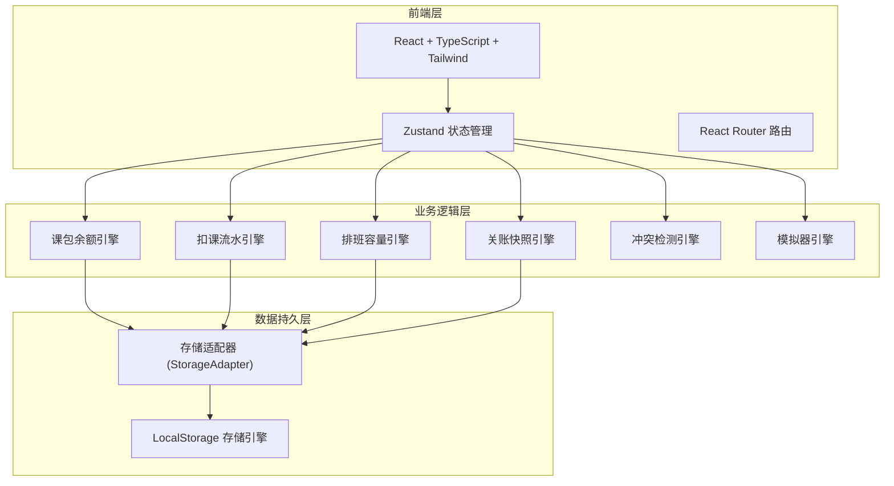
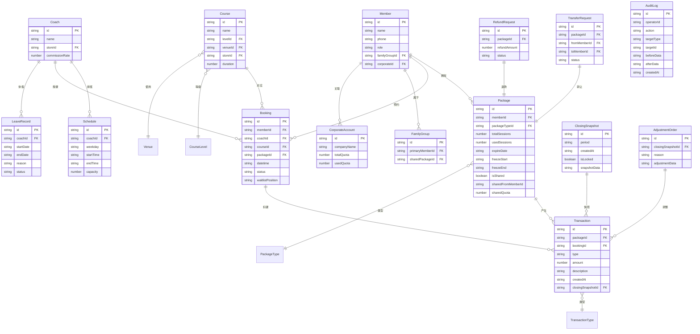

## 1. 架构设计

## 2. 技术说明

- 前端：React@18 + TypeScript + Tailwind CSS@3 + Vite
- 初始化工具：vite-init (react-ts 模板)
- 状态管理：Zustand
- 路由：React Router DOM
- 后端：无（纯前端，LocalStorage 持久化）
- 数据库：LocalStorage + 内存状态
- 图标：lucide-react
- 动画：CSS transitions + keyframes

## 3. 路由定义

| 路由 | 用途 |
|------|------|
| `/` | 总览仪表盘 |
| `/consultant/members` | 顾问端 - 会员列表 |
| `/consultant/members/:id` | 顾问端 - 会员详情(课包维护/家庭共享/企业团课) |
| `/consultant/packages` | 顾问端 - 课包管理 |
| `/consultant/transfers` | 顾问端 - 转让审批 |
| `/consultant/refunds` | 顾问端 - 退课退款 |
| `/coach/schedule` | 教练端 - 排班管理 |
| `/coach/timetable` | 教练端 - 课表视图 |
| `/coach/stats` | 教练端 - 课时统计 |
| `/member/book` | 会员端 - 预约中心 |
| `/member/packages` | 会员端 - 我的课包 |
| `/finance/transactions` | 财务端 - 流水账务 |
| `/finance/closing` | 财务端 - 月末关账 |
| `/finance/reconciliation` | 财务端 - 对账差异清单 |
| `/simulator` | 扣课模拟器 |
| `/admin/levels` | 系统管理 - 课程等级 |
| `/admin/venues` | 系统管理 - 场地容量 |
| `/admin/stores` | 系统管理 - 跨门店配置 |
| `/admin/audit` | 系统管理 - 操作审计 |

## 4. 数据模型

### 4.1 数据模型定义

### 4.2 数据定义语言（LocalStorage Schema）

所有数据以 JSON 格式存储在 LocalStorage 中，key 为实体名，value 为数组。

**核心存储键：**
- `gym_members` — 会员数组
- `gym_packages` — 课包数组
- `gym_package_types` — 课包类型数组
- `gym_coaches` — 教练数组
- `gym_schedules` — 排班数组
- `gym_leave_records` — 休假记录数组
- `gym_courses` — 课程数组
- `gym_course_levels` — 课程等级数组
- `gym_venues` — 场地数组
- `gym_stores` — 门店数组
- `gym_bookings` — 预约数组
- `gym_transactions` — 流水数组
- `gym_closing_snapshots` — 关账快照数组
- `gym_family_groups` — 家庭组数组
- `gym_corporate_accounts` — 企业账户数组
- `gym_transfer_requests` — 转让申请数组
- `gym_refund_requests` — 退款申请数组
- `gym_adjustment_orders` — 调整单数组
- `gym_audit_logs` — 审计日志数组

## 5. 核心业务引擎

### 5.1 课包余额引擎

- 余额 = Σ(正向流水) - Σ(冲正流水) + Σ(补偿流水)
- 禁止直接修改余额字段，所有余额通过流水重放计算
- 冻结期内课包不可扣减，冻结期顺延时自动延长有效期

### 5.2 扣课流水引擎

- 扣课顺序：按课包到期日升序 → 赠课优先 → 主课包次之
- 流水类型：POSITIVE(正向扣减)、REVERSAL(冲正)、COMPENSATION(补偿)、CLOSING(关账快照)、ADJUSTMENT(调整单)
- 每笔流水必须关联课包ID和预约ID（除关账/调整单）
- 关账后历史预约不可直接修改，只能生成调整单

### 5.3 排班容量引擎

- 教练容量 = 排班时段容量 - 已确认预约数
- 场地容量 = 场地最大容量 - 同一时段所有课程预约总和
- 休假期间自动释放已约课时并生成补偿流水

### 5.4 关账快照引擎

- 关账时对所有课包当前余额生成快照
- 快照后历史流水不可删除或修改
- 差异检测：快照余额 vs 流水重放余额，不平则生成差异清单

### 5.5 冲突检测引擎

- 会员时间冲突：同一会员同一时段不可重复预约
- 教练容量冲突：教练同一时段预约不可超过排班容量
- 并发预约：乐观锁 + 冲突提示，先到先得

### 5.6 模拟器引擎

- 输入：会员ID + 课程ID
- 输出：匹配课包列表（按到期顺序）、各课包扣减后余额、操作前后差异对比
- 不生成实际流水，纯计算推演
